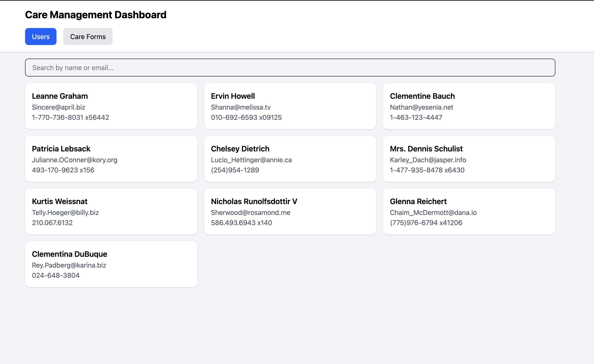

# Careflick

A React + Node.js application for managing residents and submitting care-related forms, including:

- Health Assessment Forms
- Incident Report Forms
- User Management
- Form History Tracking

The application allows caregivers to submit forms for residents and view previously submitted records.

---

## Demo

> Add your application screenshot below.



---

## Features

### User Management

- View all residents/users
- Search users by name and email
- View resident details

### Health Assessment Form

- Resident information
- Caregiver notes
- Form validation
- Data stored in MongoDB

### Incident Report Form

- Incident details
- Date and time tracking
- Location information
- Follow-up notes
- Data stored in MongoDB

### Form History

- View all submitted forms for a resident
- Health Assessment history
- Incident Report history
- Submission timestamps

---

## Tech Stack

### Frontend

- React
- TypeScript
- Vite
- Tailwind CSS
- React Hook Form
- Axios
- React Hot Toast

### Backend

- Node.js
- Express.js
- MongoDB
- Mongoose

---

## Project Structure

### Frontend

```txt
frontend/
├── src/
│   ├── components/
│   ├── pages/
│   ├── layouts/
│   ├── services/
│   ├── context/
│   ├── types/
│   ├── utils/
│   └── App.tsx
└── package.json
```

### Backend

```txt
backend/
├── src/
│   ├── config/
│   ├── models/
│   ├── controllers/
│   ├── routes/
│   ├── middleware/
│   ├── validators/
│   ├── utils/
│   ├── seed/
│   ├── app.js
│   └── server.js
├── .env
└── package.json
```

---

## Installation

### Clone Repository

```bash
git clone https://github.com/Dheerendra69/Careflick.git
cd careflick
```

---

## Frontend Setup

```bash
cd frontend

npm install

npm run dev
```

Frontend will run on:

```txt
http://localhost:5173
```

---

## Backend Setup

```bash
cd backend

npm install

npm run dev
```

Backend will run on:

```txt
http://localhost:4000
```

---

## Environment Variables

Create a `.env` file inside the backend directory:

```env
PORT=4000

MONGO_URI=mongodb://127.0.0.1:27017/careflick
```

For MongoDB Atlas:

```env
PORT=4000

MONGO_URI=<your-mongodb-atlas-uri>

```
I have used mongod-db for deployment

---

## API Endpoints

### Users

#### Get All Users

```http
GET /api/users
```

#### Get User By ID

```http
GET /api/users/:id
```

#### Create User

```http
POST /api/users
```

#### Update User

```http
PUT /api/users/:id
```

#### Delete User

```http
DELETE /api/users/:id
```

---

### Forms

#### Get All Forms

```http
GET /api/forms
```

#### Get Forms By User

```http
GET /api/forms/user/:userId
```

#### Create Form

```http
POST /api/forms
```

Example payload:

```json
{
  "userId": "684a5cfd8e9b2f6d1c3a1234",
  "formType": "health-assessment",
  "formData": {
    "residentName": "Leanne Graham",
    "caregiverName": "John Doe",
    "temperature": "98.6"
  }
}
```

#### Delete Form

```http
DELETE /api/forms/:id
```

---

## Database Schema

### User

```js
{
  name: String,
  email: String,
  phone: String,
  address: Object,
  company: Object
}
```

### Form Submission

```js
{
  userId: ObjectId,
  formType: String,
  formData: Object,
  createdAt: Date,
  updatedAt: Date
}
```

---

## Future Improvements

- Authentication & Authorization
- Form Editing
- Form Deletion UI
- Pagination
- Advanced Search & Filters
- Dashboard Analytics
- PDF Export
- Role-Based Access Control (RBAC)

---

## Author

**Dheerendra Singh**

Software Developer | MERN Stack Developer